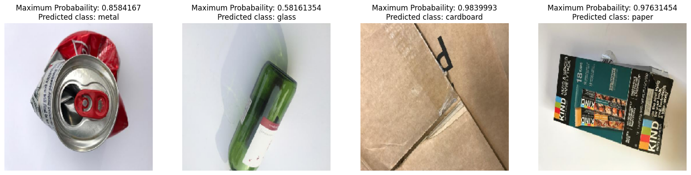
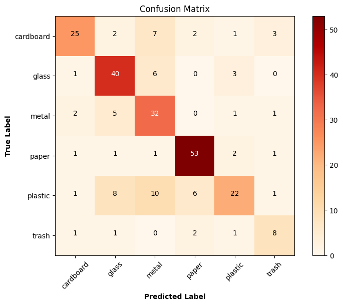
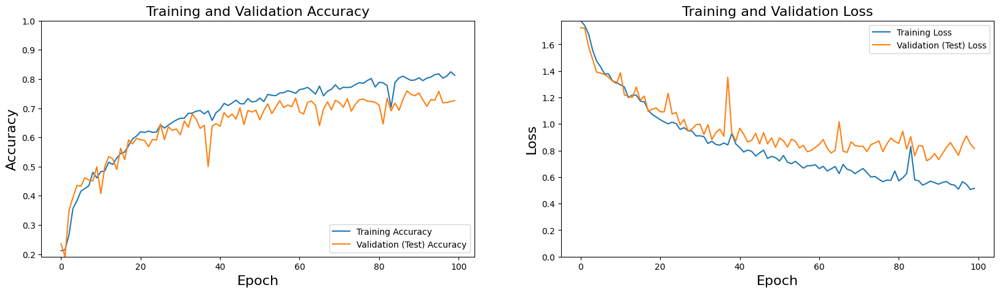

# ♻️ Solid Waste Classification with CNN

**A convolutional neural network trained from scratch to sort waste images into six recycling categories.**




---

## 📌 Problem

Recycling only works if waste is sorted correctly, and manual sorting is slow, costly and error-prone. This project builds an image classifier that recognizes the material of a waste item from a photo, a building block for automated sorting lines and smart bins.

---

## 🗂️ Dataset

**Garbage Classification** (TrashNet-style), 2,527 RGB images in 6 classes:

| Class | cardboard | glass | metal | paper | plastic | trash |
|---|---|---|---|---|---|---|
| **Label** | 0 | 1 | 2 | 3 | 4 | 5 |

- Images resized to **224×224**
- **90 / 10** train / validation split (2,276 / 251 images)
- **Augmentation:** horizontal and vertical flips, shear, zoom, width/height shifts, rescaling to [0, 1]

The dataset is not included in this repo. Download it from Kaggle by searching for "Garbage classification" (6 classes, 2,527 images) and set `dir_path` in the notebook to its location.

---

## 🧠 Model

A compact CNN trained from scratch (≈1.65M parameters):

```
Input 224×224×3
→ Conv2D(32, 3×3, ReLU) → MaxPool(2×2)
→ Conv2D(64, 3×3, ReLU) → MaxPool(2×2)
→ Conv2D(32, 3×3, ReLU) → MaxPool(2×2)
→ Flatten → Dense(64, ReLU) → Dropout(0.2)
→ Dense(32, ReLU) → Dropout(0.2)
→ Dense(6, Softmax)
```

- **Loss / optimizer:** categorical cross-entropy, Adam
- **Training:** up to 100 epochs with EarlyStopping and ModelCheckpoint on validation loss
- **Metrics:** accuracy, precision, recall, per-class F1

---

## 📊 Results (validation set, 251 images)

| Metric | Value |
|---|---|
| Accuracy | **72%** |
| Precision | 80% |
| Recall | 65% |
| Macro F1 | 0.69 |

| Class | Precision | Recall | F1 |
|---|---|---|---|
| cardboard | 0.81 | 0.62 | 0.70 |
| glass | 0.70 | 0.80 | 0.75 |
| metal | 0.57 | 0.78 | 0.66 |
| paper | **0.84** | **0.90** | **0.87** |
| plastic | 0.73 | 0.46 | 0.56 |
| trash | 0.57 | 0.62 | 0.59 |

**Paper** is the easiest class. **Plastic** is the hardest: it is often confused with glass and metal, since transparent and shiny surfaces look alike at low resolution.

<p align="center">
  
</p>



---

## 🚀 Run It

The notebook was developed on **Google Colab** with the dataset stored in Google Drive.

1. Open `Solid_Waste_Detection_with_CNN.ipynb` in Colab.
2. Upload the dataset to your Drive and update `dir_path`.
3. Run all cells. The best model is saved as `mymodel.h5`.

To classify a new image:

```python
img, probs, cls = model_testing("path/to/image.jpg")
print(waste_labes[cls], probs.max())
```

---

## 🔭 Next Steps

- **Transfer learning:** fine-tuning a pretrained backbone (ResNet-50, EfficientNet) typically lifts accuracy on this dataset well above 90%, a natural next experiment.
- **Separate test set:** the validation set currently drives early stopping *and* the final evaluation. A held-out test split would give an unbiased score.
- **Augmentation-free validation:** the validation generator should rescale only, without augmentation.
- **Class imbalance:** `trash` has far fewer samples, so class weights or oversampling could help.
- **Deployment:** export to TensorFlow Lite for an edge device such as a Raspberry Pi smart bin.

---

<sub>Developed by [Yusuf Korkmazyiğit](https://github.com/yusufkorkmazyigit), Computer Engineering, Erciyes University.</sub>
